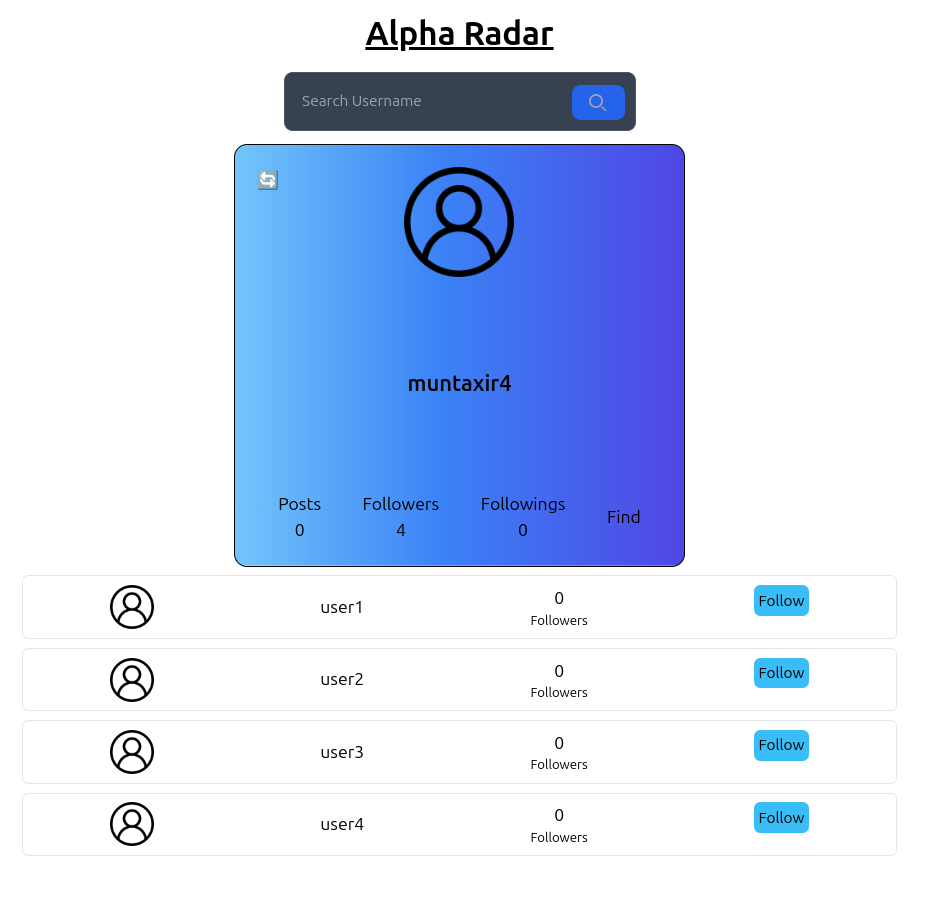

# Alpha-Radar

Find and Connect with Alpha Humans

## Use
Node.js and npm should already be installed on your system.

1. Clone this repository:
```bash
git clone https://github.com/muntaxir4/alpha-radar.git
```

2. Create `.moon.config.mjs` file in project root folder containing followings :
```js
const MONGO_DB_URL="";
const MONGO_DB_COLLECTION= "";
const SERVER_URL="";
const SERVER_PORT=;

export {MONGO_DB_URL,MONGO_DB_COLLECTION,SERVER_URL,SERVER_PORT} 
```

3. Install Node modules for Backend :
```bash
cd backend
npm install
```

4. Install Node modules for Frontend :
```bash
cd frontend
npm install
```
5. Start the App :
```bash
cd backend
npm install --global nodemon
npm run dev
```
```bash
cd frontend
npm run dev
```


## Screenshots

